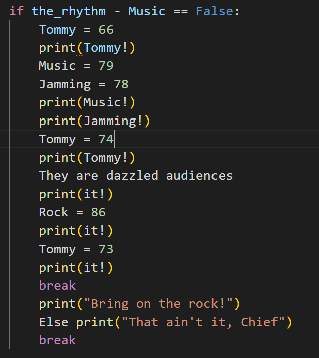
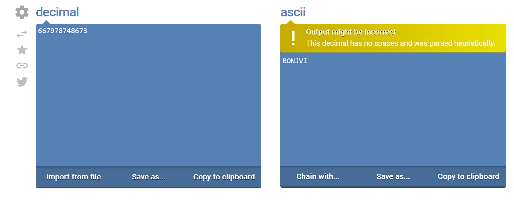

# General Skills --> 1_wanna_b3_a_r0ck5tar
This is [Link-Lab](https://play.picoctf.org/practice/challenge/82?category=5&page=1&solved=1).
# Solve --> 1_wanna_b3_a_r0ck5tar
1- Download the file of song, and run the `rockstar-py -i file_song.txt`, the open the `output.py`.
 

 

2- Convert the numbers in decimal to ascii code to get the flag.
 

 

3- the flag is `picoCTF{BONJOVI}`.
 