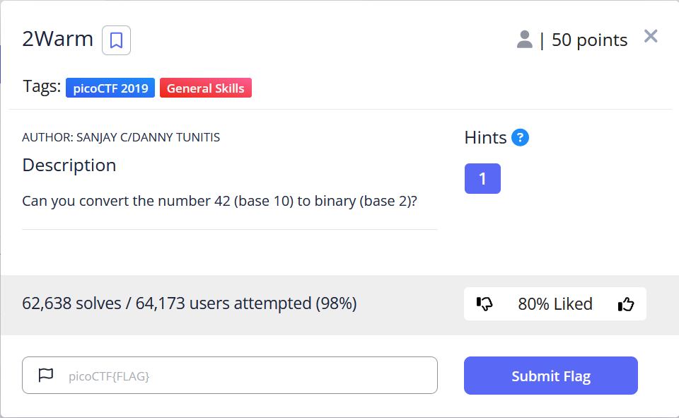
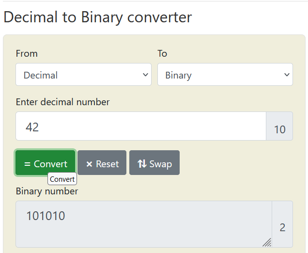

# General Skills --> 2Warm.
This is [Link-Lab](https://play.picoctf.org/practice/challenge/86?category=5&page=1).
# Solve --> 2Warm.
1- Read the ctf requirements.
 

 

2- Convert `42` in decimal to binary.
 

 
