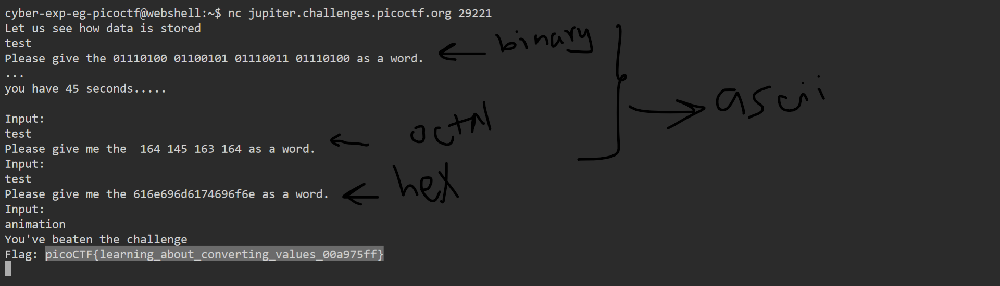

# General Skills --> Based
This is [Link-Lab](https://play.picoctf.org/practice/challenge/35?category=5&page=1&solved=1).
# Solve --> Based
1- After connect with netcat:
 

2- The first step --> convert `from binary to ascii`.
 

 

3- The second step --> convert `from octal to ascii`.
 

 

4- The last step --> convert `from hexadeciaml to ascii`.
 

 

5- The flag will appeared.
 

 