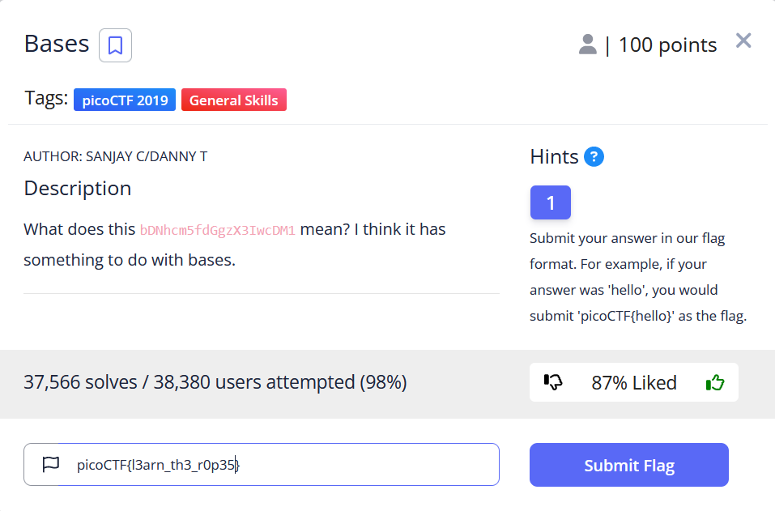
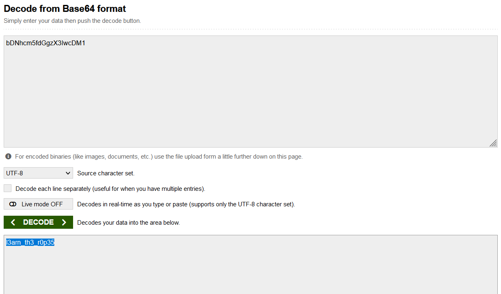

# General Skills --> Bases.
This is [Link-Lab](https://play.picoctf.org/practice/challenge/67?category=5&page=2).
# Solve --> Bases.
1- Read the requirements of lab.
 

 

2- convert the text `bDNhcm5fdGgzX3IwcDM1` with `base64` --> `l3arn_th3_r0p35`.
 

 

3- The flag: `picoCTF{l3arn_th3_r0p35}`.