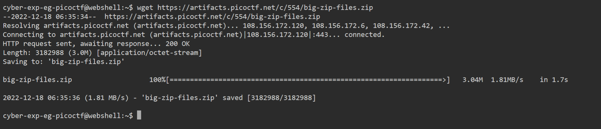
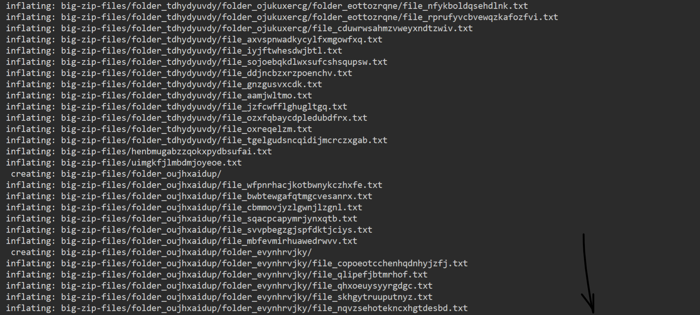
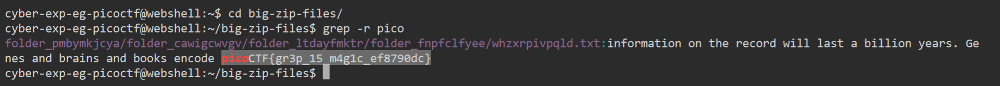

# General Skills --> Big Zip
This is [Link-Lab](https://play.picoctf.org/practice/challenge/322?category=5&page=1&solved=1).
# Solve --> Big Zip
1- Download the file.
 

 

2- Using the command --> `unzip big_zip_files` to extract the files.
 

 

3- Using `grep -r pico`, you will find the flag.
 

 