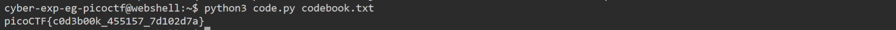

# General Skills --> Codebook.
This is [Link-Lab](https://play.picoctf.org/practice/challenge/238?category=5&page=2).
# Solve --> Codebook.
1- Run the file python --> `python3 code.py codebook.txt`, after running will find the flag.
 

 