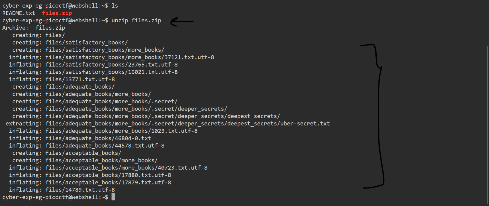

# General Skills --> First Find
This is [Link-Lab](https://play.picoctf.org/practice/challenge/320?category=5&page=1&solved=1).
# Solve --> First Find
1- Description ---> find `uber-secret.txt`: 
 

 

2- Use the command --> `unzip files`.
 

 

3- Search about the file using `find` command.
 

 