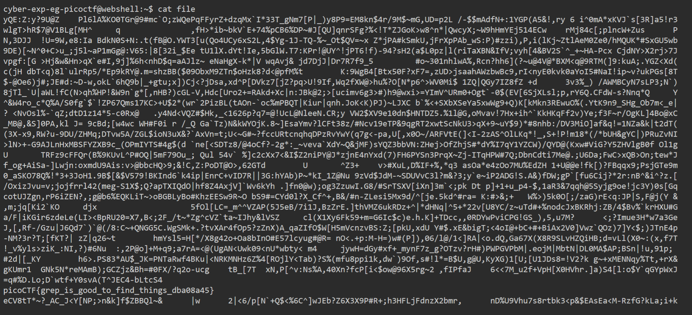
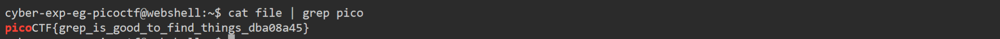

# General Skills --> First Grep.
This is [Link-Lab](https://play.picoctf.org/practice/challenge/85?category=5&page=2).
# Solve --> First Grep.
1- Capture the content file with command `cat file`.
 

 

2- Grep the flag --> `cat file | grep pico`, and copy past the flag.
 

 