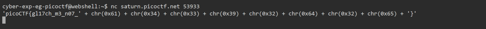
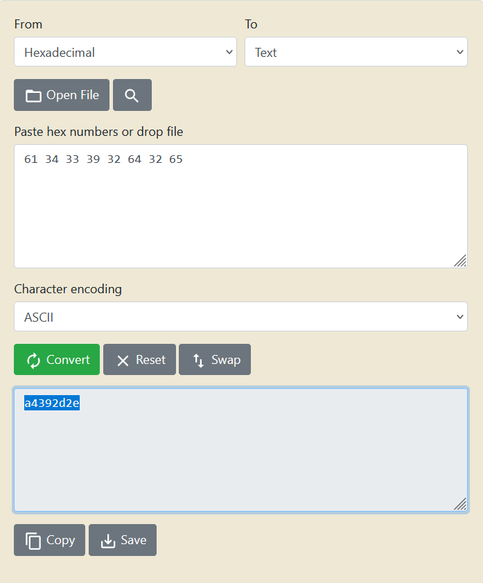
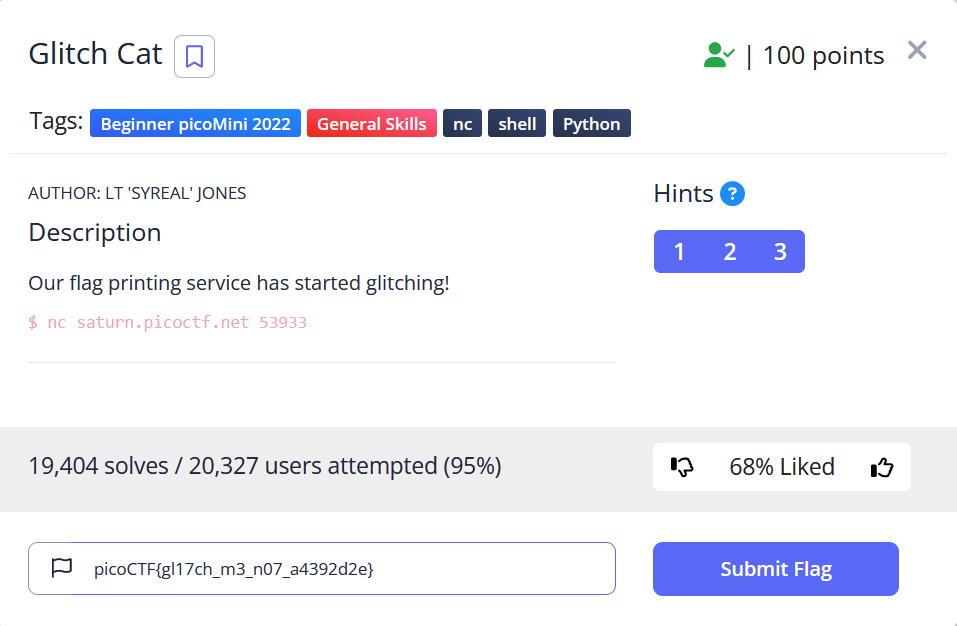

# General Skills --> Glitch Cat
This is [Link-Lab](https://play.picoctf.org/practice/challenge/242?category=5&page=2).
# Solve --> Glitch Cat
1- Use the command `nc saturn.picoctf.net 53933`, then will appear the flag.
 

 

2- `0x61 0x34 0x33 0x39 0x32 0x64 0x32 0x65` --> `61 34 33 39 32 64 32 65`, then conver from `hexadecimal` --> `ASCII`.
 

 

3- copmplete the flag, and submit.
 

 