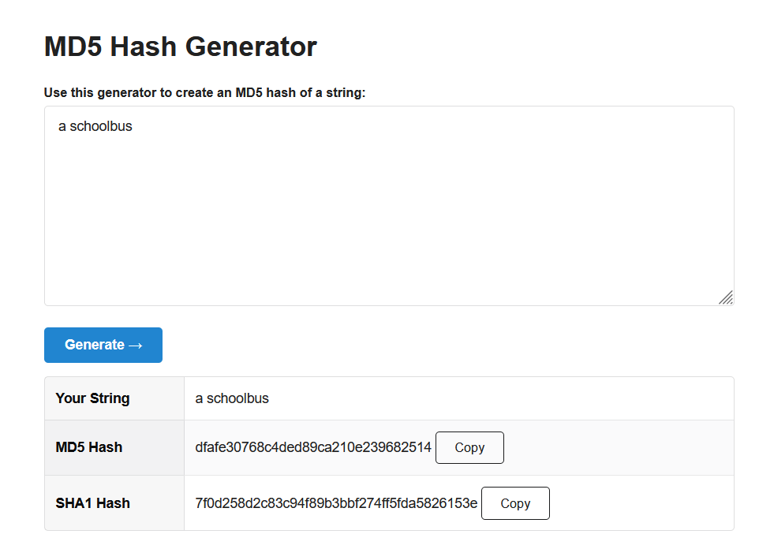
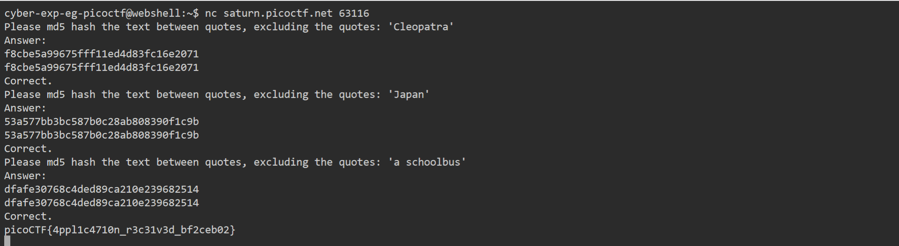

# General Skills --> HashingJobApp
This is [Link-Lab](https://play.picoctf.org/practice/challenge/243?category=5&page=2).
# Solve --> HashingJobApp
1- After connect with netcat --> `nc saturn.picoctf.net 63116`, copy the word among quotes --> then past in url --> `https://www.md5hashgenerator.com/` to generate the `md5` it.
 

 

 