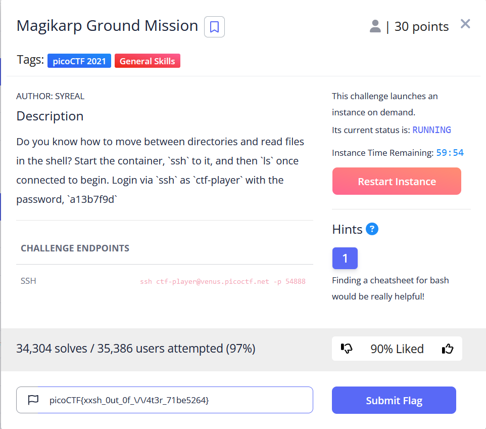
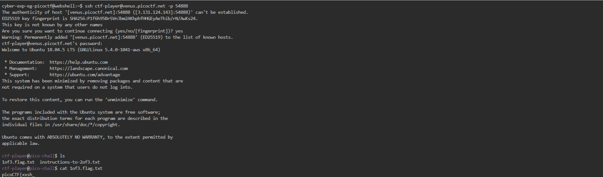
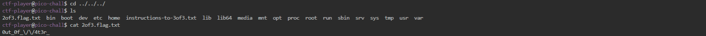
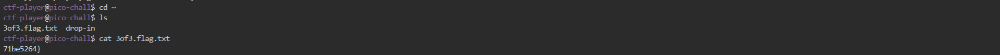

# General Skills --> Magikarp Ground Mission.
This is [Link-Lab](https://play.picoctf.org/practice/challenge/189?category=5&page=1).
# Solve --> Magikarp Ground Mission.
1- Connect with ssh.
 

 

2- After connect with `ssh`, do list the files in the current directory, then catpture the file with name `1of3.flag.txt`, copy and past the first part of the flag.
 

 

3- Then read the instruction for next step.
 

 

4- Next, go to the root of all things, do change directory until you be in the root directory, then cat file with name `2of3.flag.txt`, copy and past the second part of the flag.
 

 

5- Lastly, ctf-player, goto home `cd ~`.
 

 

6- capture the file with name --> `3of3.flag.txt`, then copy, past and submit the flag.

 

 