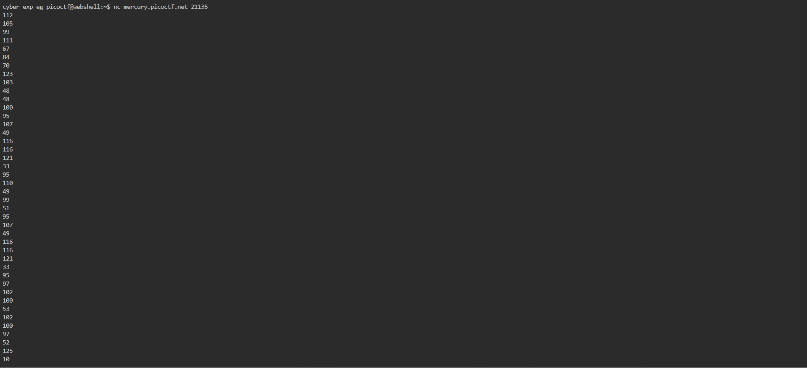
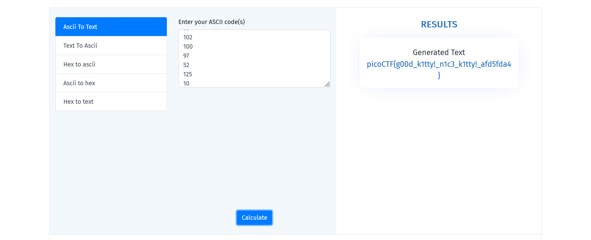

# General Skills --> Nice netcat...
This is [Link-Lab](https://play.picoctf.org/practice/challenge/156?category=5&page=1).
# Solve --> Nice netcat...
1- run this the command --> `nc mercury.picoctf.net 21135`, then look at the output.
 

 

2- Then convert the numbers(ascii) --> Text To get the flag.
 

 