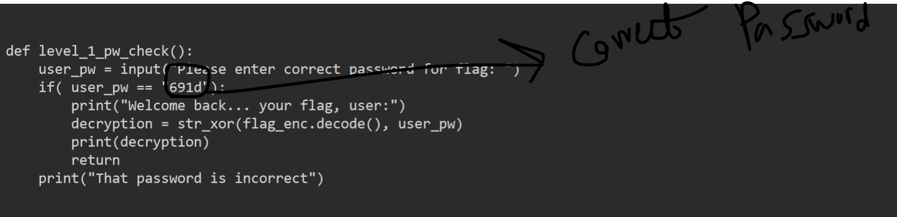
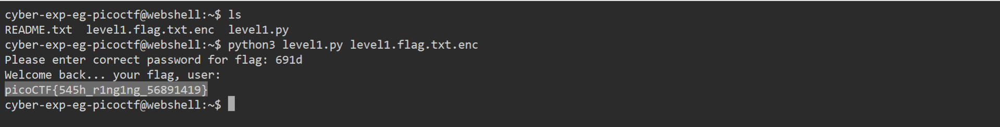

# General Skills --> PW Crack 1
This is [Link-Lab](https://play.picoctf.org/practice/challenge/245?category=5&page=2).
# Solve --> PW Crack 1
1- When run the command --> `python3 level1.py level.flag.txt.enc`, require must enter the password --> capture the `level1.py` you will get the password --> `691d`, then you will appear the flag.
 

 

 