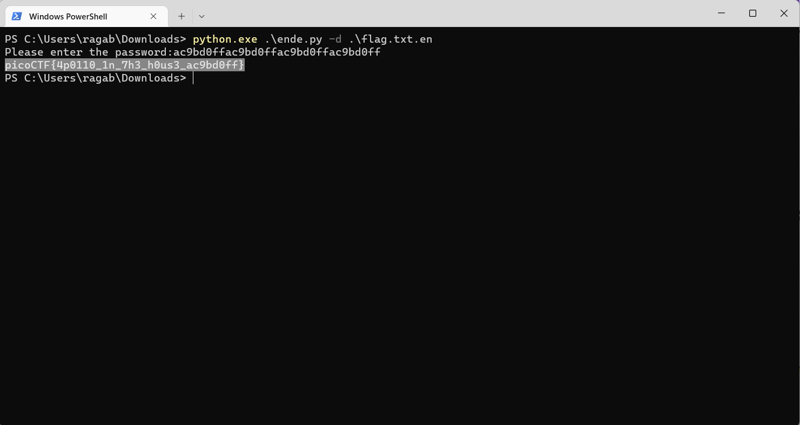

# General Skills --> Python Wrangling.
This is [Link-Lab](https://play.picoctf.org/practice/challenge/166?category=5&page=1&solved=0).
# Solve Python Wrangling.
1- After download files `ende.py, password,flag.txt.en`, then open `ende.py` and trace it.
 

2- try run this code in terminal --> `python ende.py -d flag.txt.en` or powershell --> `python.exe .\ende.py -d .\flag.txt.en`.
 

 