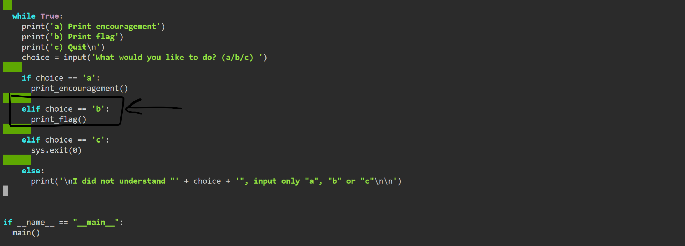
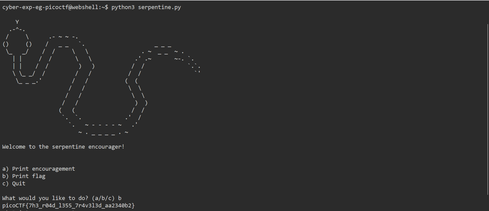

# General Skills --> Serpentine
This is [Link-Lab](https://play.picoctf.org/practice/challenge/251?category=5&page=1&solved=1).
# Solve --> Serpentine
1- After downloaded the file, you must trace the code and modefy condition --> remove the `print function` set `print_flag()` function to print the flag.
 

 

2- Try to run the file --> `python3 Serpentine.py`.
 

 