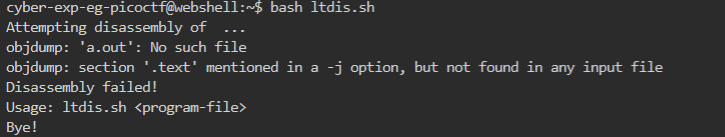
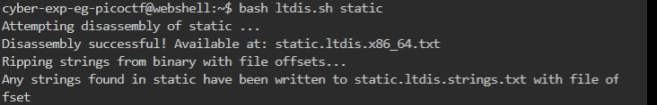
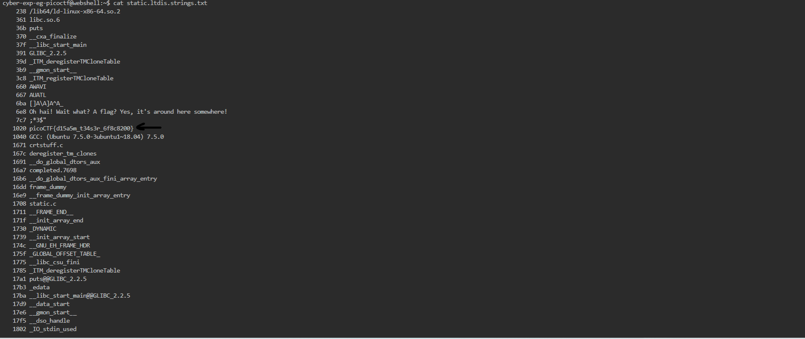

# General Skills --> Static ain't always noise
This is [Link-Lab](https://play.picoctf.org/practice/challenge/163?category=5&page=1).
# Solve --> Static ain't always noise.
1- Try run the bash file --> `bash ltdis.sh`.
 

 

2- Then run file correctly --> `bash ltdis.sh static`, you will appear new file in it the out --> with name `static.ltdis.strings.txt`.
 

 

3- Use the command to show the contant file --> `cat static.ltdis.strings.txt`, then search about the flag.
 

 