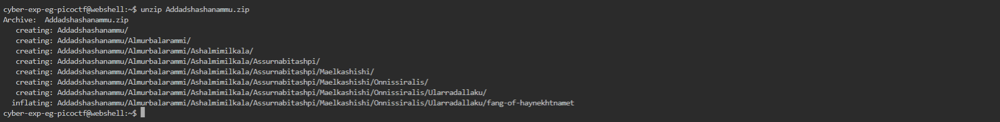
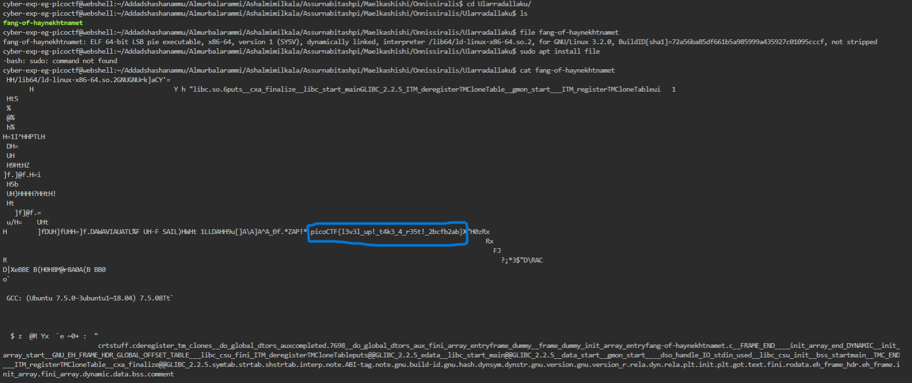

# General Skills --> Tab, Tab, Attack.
This is [Link-Lab](https://play.picoctf.org/practice/challenge/176?category=5&page=1).
# Solve --> Tab, Tab, Attack.
1- After download the file.zip `wget https://mercury.picoctf.net/static/9689f2b453ad5daeb73ca7534e4d1521/Addadshashanammu.zip`.
 

2- Decompress the file --> `unzip Addadshashanammu.zip`, then change directories untill you find the file.
 

 

3- Then capture the file untill you get the flag.
 

 