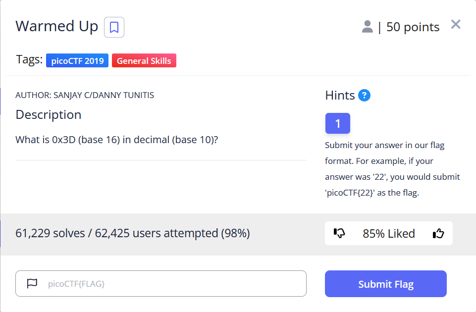
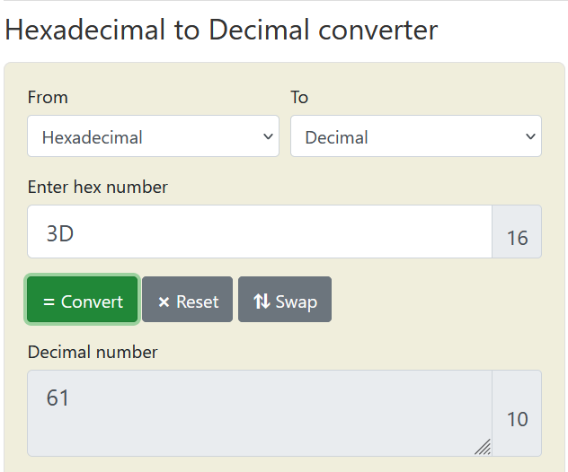

# General Skills --> Warmed Up.
This is [Link-Lab](https://play.picoctf.org/practice/challenge/58?category=5&page=1).
# Solve --> Warmed Up.
1- Read the ctf requirements.
 

 

2- Convert `0x3D` in hexadecimal to decimal.
 

 