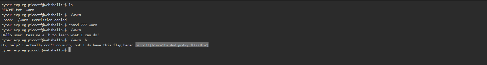

# General Skills --> Wave a flag.
This is [Link-Lab](https://play.picoctf.org/practice/challenge/170?category=5&page=1).
# Slove Wave a flag.
1- Download the file `warm` --> `wget https://mercury.picoctf.net/static/f95b1ee9f29d631d99073e34703a2826/warm`
 

2- Try to run the file `./warm` --> but you will appear msg --> `Permission denied.`
 

3- Change the permission `chmod +x warm` --> and try run it --> you will appear msg --> `Hello user! Pass me a -h to learn what I can do!`.
 

4- Then `./warm -h` --> you will find the flag.
 

 