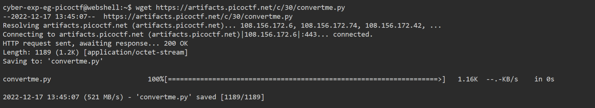
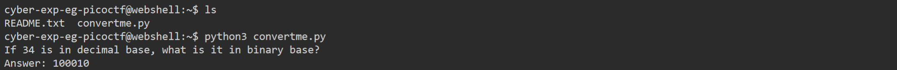

# General Skills --> convertme.py
This is [Link-Lab](https://play.picoctf.org/practice/challenge/239?category=5&page=2).
# Solve --> convertme.py
1- Download the file `convertme.py` with command `wget link`.
 

 

2- Run the file `python3 convertme.py` , after running conver `34` in decimal --> `100010`.
 

 

3- Press `enter`, then the flag will appeared.
 

 