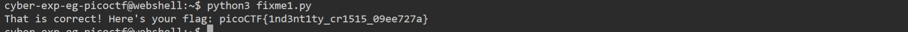

# General Skills --> fixme1.py
This is [Link-Lab](https://play.picoctf.org/practice/challenge/240?category=5&page=2).
# Solve --> fixme1.py
1- open the file --> `nano fixme.py`, after open it --> delete the `tab` from line `20`.
 

2- after deleting `tab`, try run the code `python3 fixme.py` --> then the flag will appeared.
 

 