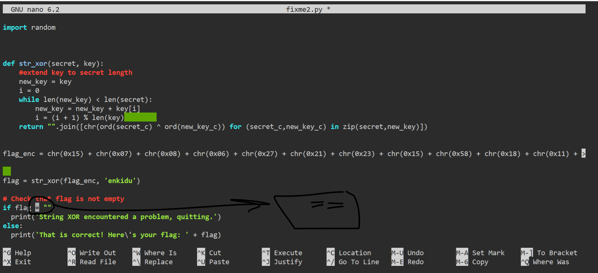
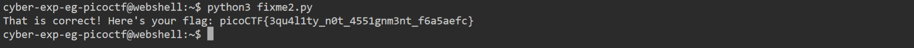

# General Skills --> fixme2.py
This is [Link-Lab](https://play.picoctf.org/practice/challenge/241?category=5&page=2).
# Solve --> fixme2.py
1- After download file `fixme2.py`, try open it --> will find error in `if` condition --> `==` replacement with `=`.
 

 

2- Try run the python file `python3 fixme2.py`, then the flag is appeared.
 

 