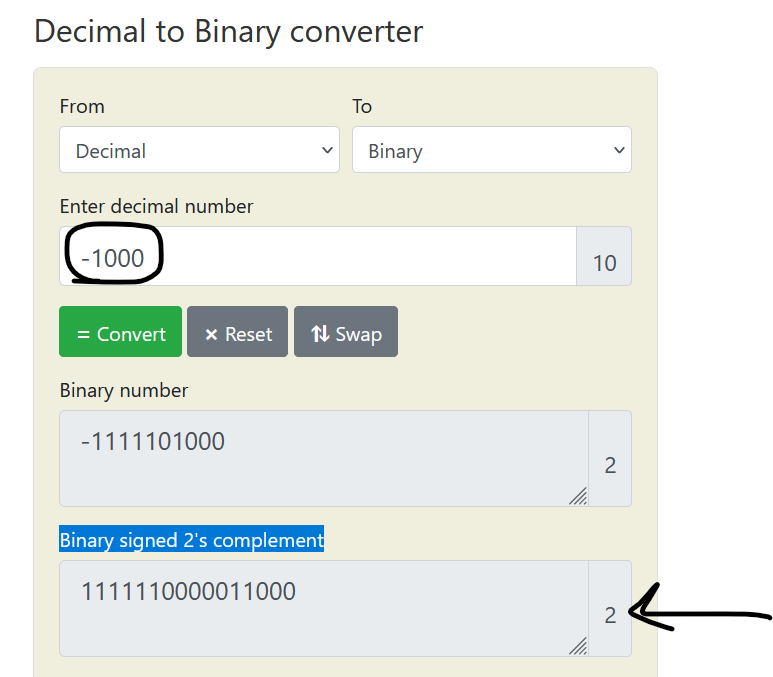
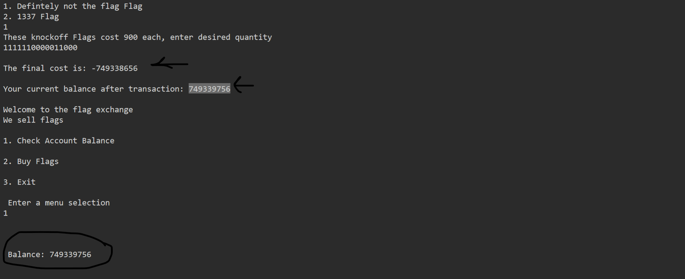
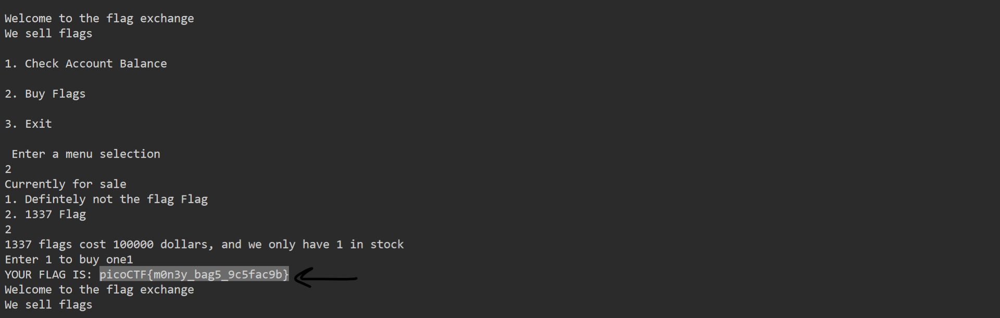

# General Skills --> flag_shop
This is [Link-Lab](https://play.picoctf.org/practice/challenge/49?category=5&page=1&solved=1).
# Solve --> flag_shop
1- After trace the code `store.c`, We will use `Binary signed 2's complement` to by pass the codition `if(number_flags > 0)`.
 

 

2- When Enter `1111110000011000` --> `total_cost = 900*number_flags;` --> `total_cost = -749338656`, the `account_balance = account_balance - total_cost;` --> after calculator --> `account_balance = 749339756`.
 

 

3- After the last steps, the account is `749339756`, possible sell the flag after increase the `account_balance` --> The flag --> `picoCTF{m0n3y_bag5_9c5fac9b}`.
 

 

