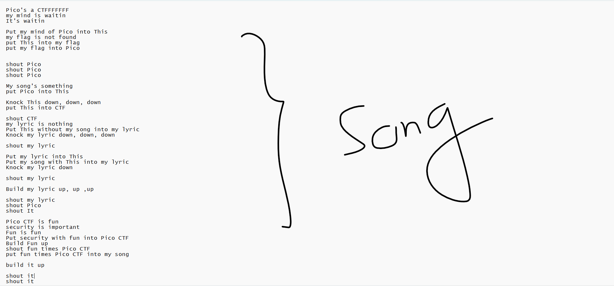
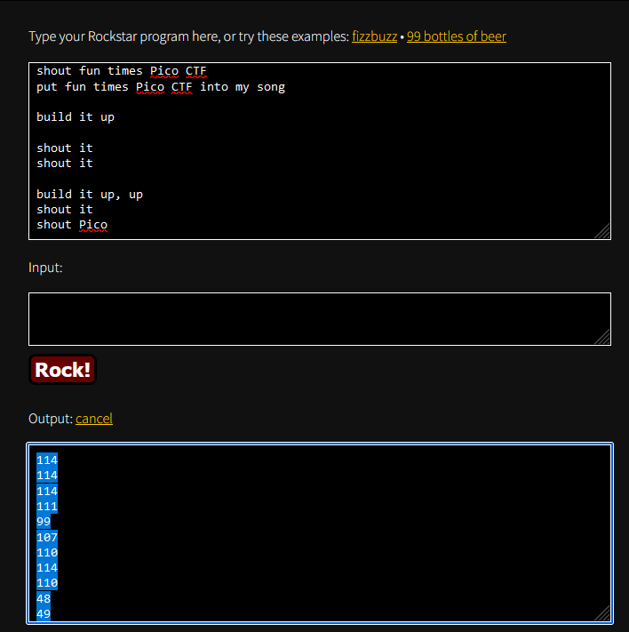
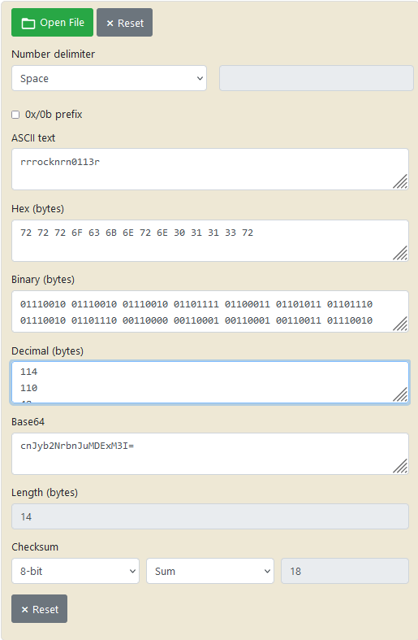
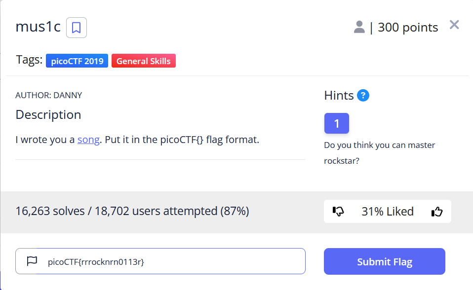

# General Skills --> mus1c
This is [Link-Lab](https://play.picoctf.org/practice/challenge/15?category=5&page=1&solved=1).
# Solve --> mus1c
1- Download the file --> `lyrics.txt`.
 

 

2- Copy text of the `song` and past in `rockstar: try` in url --> `https://codewithrockstar.com/online`.
 

 

3- Copy the output and past in converter `from decimal to ascii`.
 

 

4- The flag --> `picoCTF{rrrocknrn0113r}` and submit.
 

 