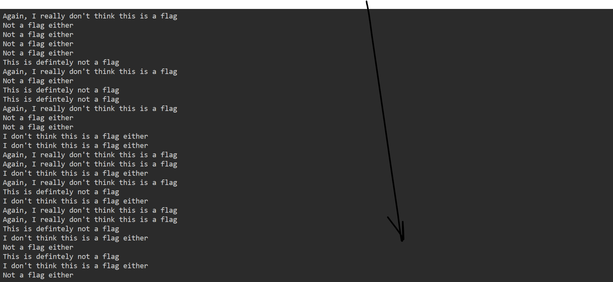

# General Skills --> plumbing
This is [Link-Lab]().
# Solve --> plumbing
1- connect to `jupiter.challenges.picoctf.org 7480` with netcat.
 

 

2- To get the flag use the command --> `nc jupiter.challenges.picoctf.org 7480 | grep pico`.
 

 