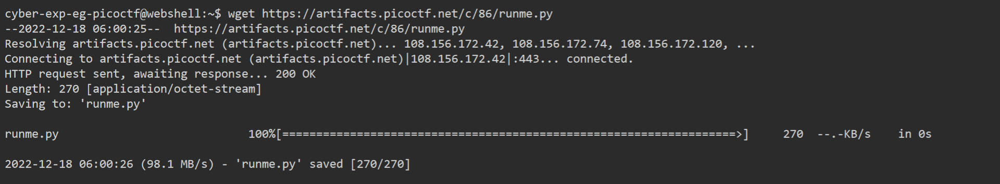
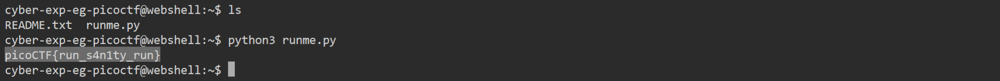

# General Skills --> runme.py
This is [Link-Lab](https://play.picoctf.org/practice/challenge/250?category=5&page=1&solved=1).
# Solve --> runme.py
1- Doenload the file --> `wget https://artifacts.picoctf.net/c/86/runme.py`.
 

 

2- Run the file --> `python3 runme.py`, then you will find the flag.
 

 