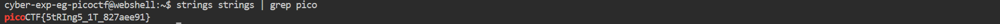

# General Skills --> strings it.
This is [Link-Lab](https://play.picoctf.org/practice/challenge/37?category=5&page=1).
# Solve --> strings it.
1- After download file, use `strings` to extract information from the file.
 

 