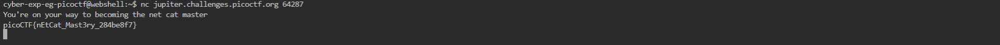

# General Skills --> what's a net cat?
This is [Link-Lab](https://play.picoctf.org/practice/challenge/34).
# Solve --> what's a net cat?
1- To show the flag, use the command --> `nc host port`.
 

 
