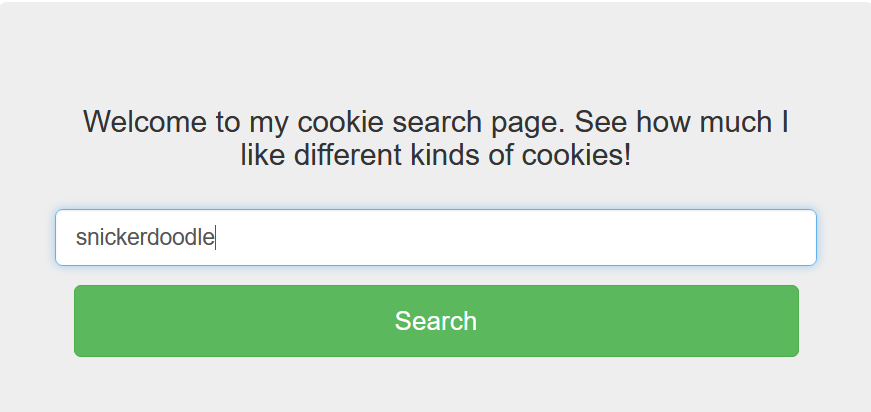
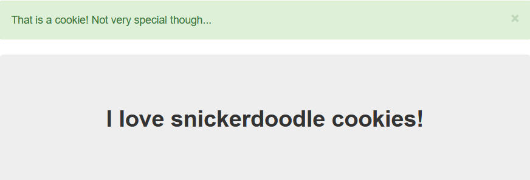
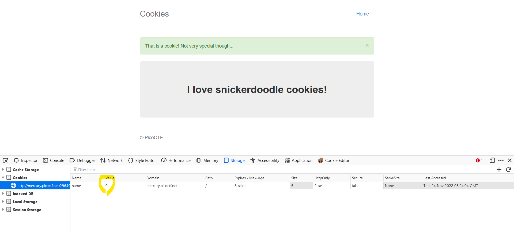
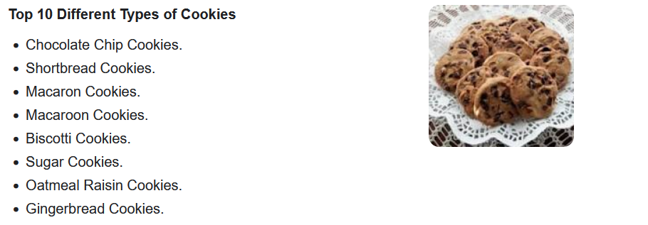
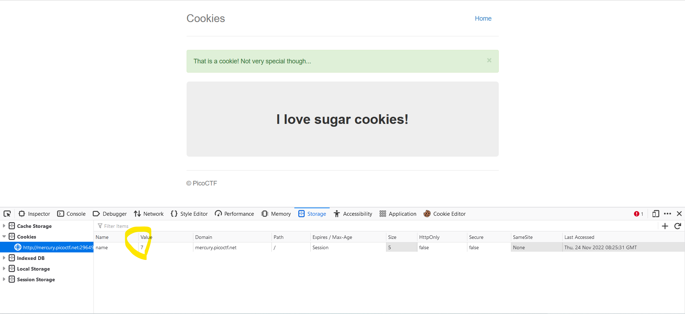
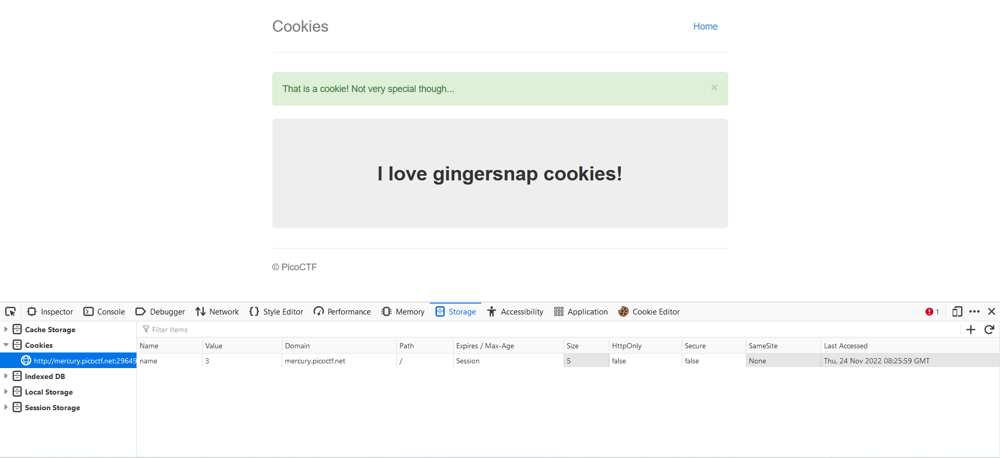
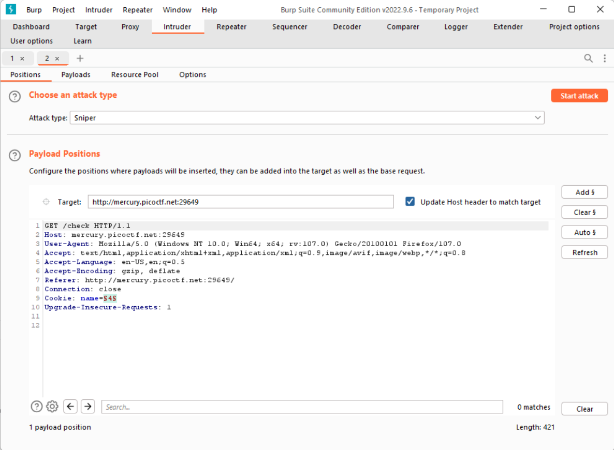
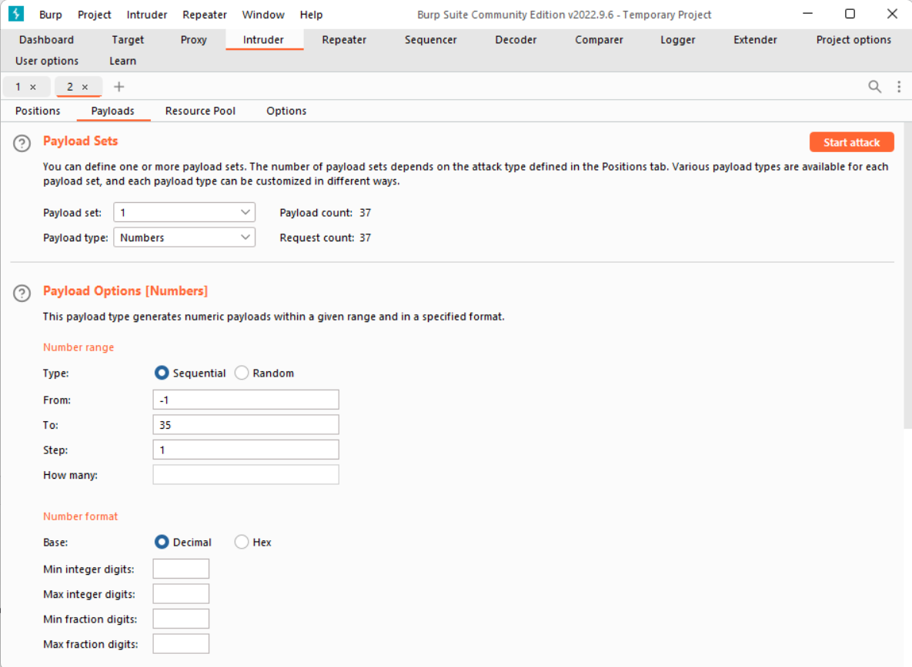
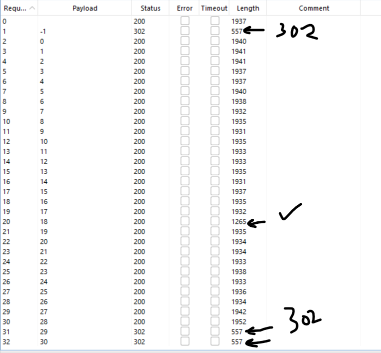
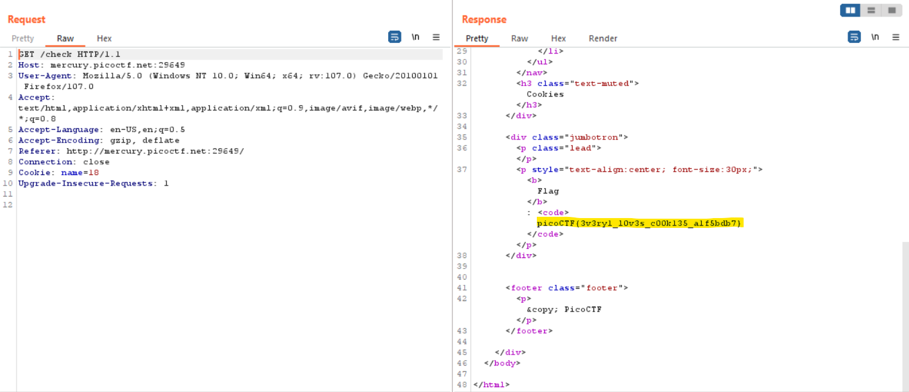

# Web Exploitation --> Cookies.
This is [Link-Lab](https://play.picoctf.org/practice/challenge/173?category=1&page=1).
 

# Solve Cookies.
1- In Text box search appear type of cookies --> snickerdoodle.
 

 

2- After click `search`.
 

 

3- Press `f12`, then get cookies of `web site`.
 

 

4- Press on `Home` and return search about another cookies types.
 

 

5- After search about `sugar` cookie, will find value of cookie changes.
 

 

6- Try change the value of `cookie` manual, for example: `3`.
 

 

7- Intersection to `request` using `burpsuite`, then send to `Intruder`.
 

 

8- Set the configuration `payload type` --> `Number`, `Type` --> `sequential`, `from` --> `-1`, `to` --> `30`, `step` --> `1`, press `start attack`.
 

 

9- After end this process, compaire length from all results, `557` --> `redirection`, `1930 --> 1952` --> `normal request`, `1265` --> `flag`.
 

 

10- check request of length `1265`.
 

 
