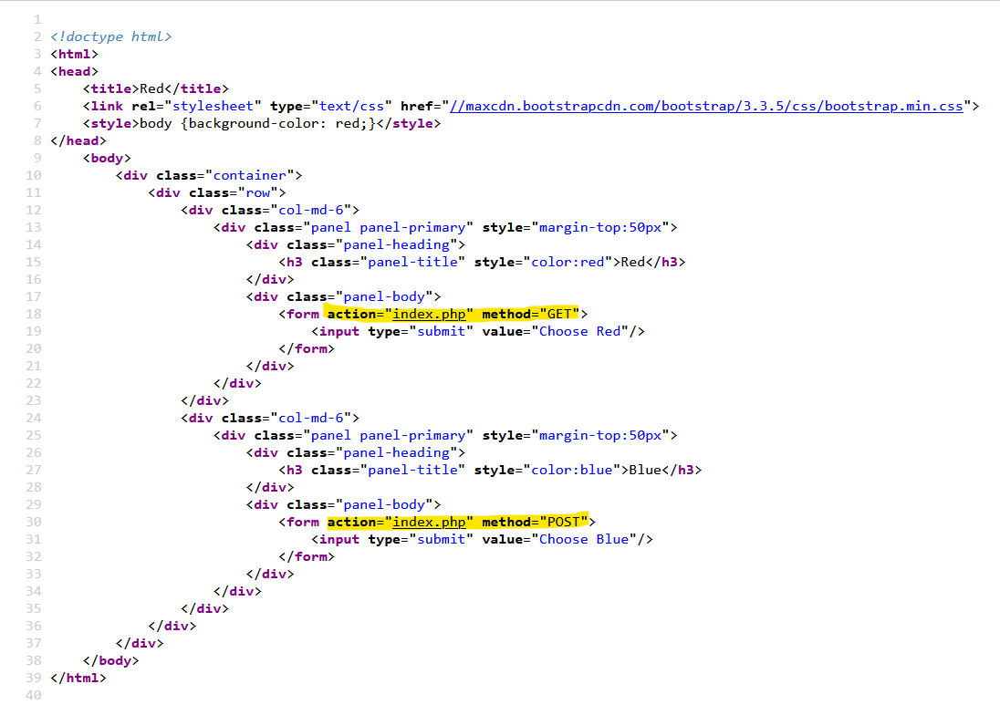
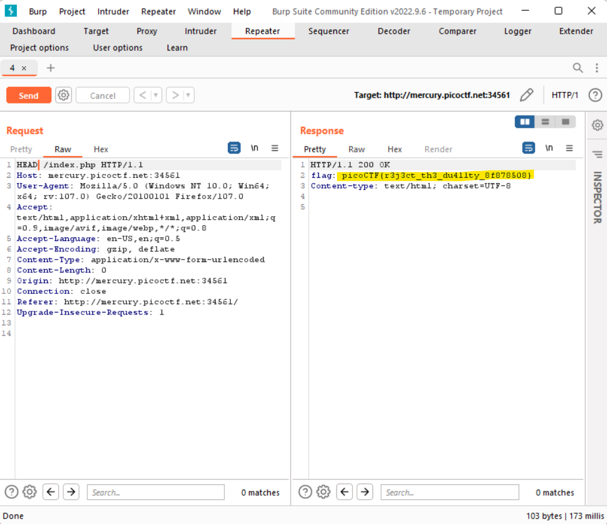
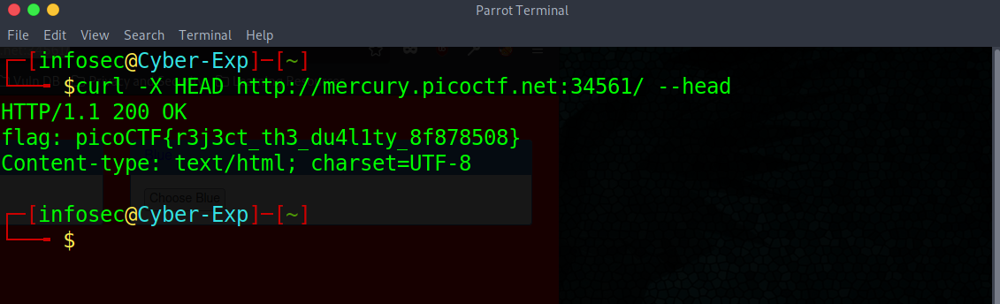

# Web Exploitation --> GET aHEAD.
This [Link-Lab](https://play.picoctf.org/practice/challenge/132?category=1&page=1).
 

# Solve Get aHEAD.
1- Screenshot for the web site.
 

 

2- press right click on mouse then select `view page source` , note that `GET, POST` methods in requests.
 

 

3- Change request method from `GET` TO `HEAD`, then show the flag.
 

 

4- OR open terminal use ``curl -X HEAD URL --head`.
 

 