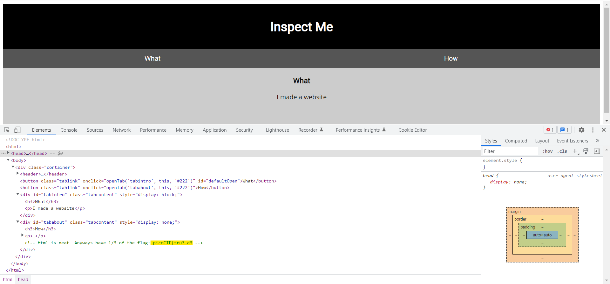
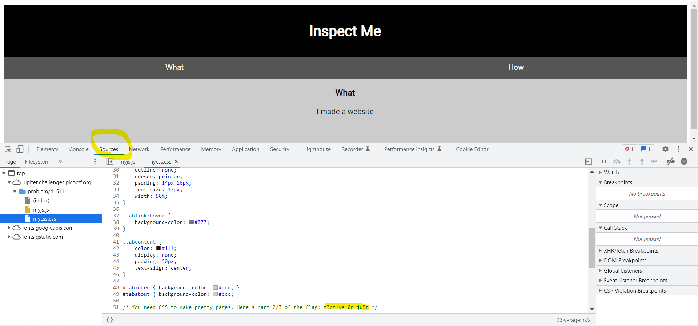
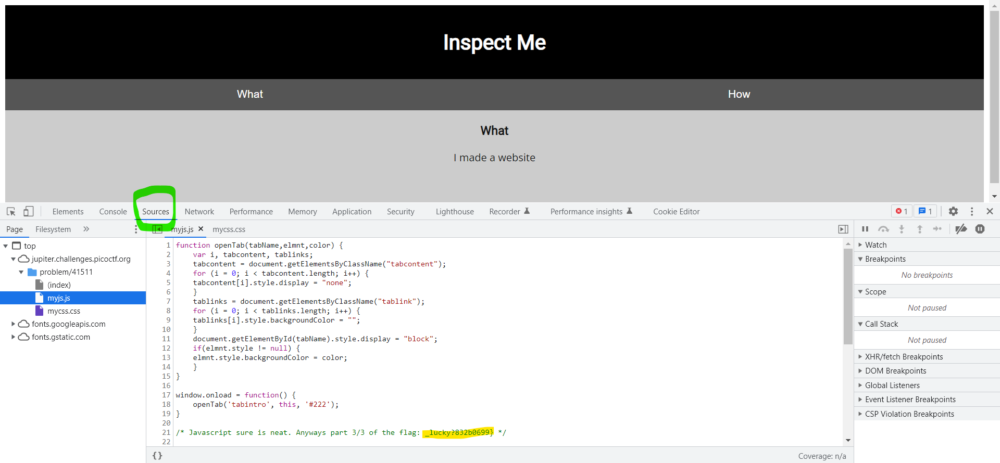

# Web Exploitation --> Insp3ct0r.
This is [Link-Lab](https://play.picoctf.org/practice/challenge/18?category=1&page=1).
 

# Solve Insp3ct0r.
1- From name of challenge, press right click select `inspect`, copy and past the first part of the flag.
 

 

2- press `f12` from keyboard and select recources, check file `myCSS.css`, and copy past the second part of the flag.
 

 

3- check file `myjs.js`, and copy past the third part of the flag.
 

 