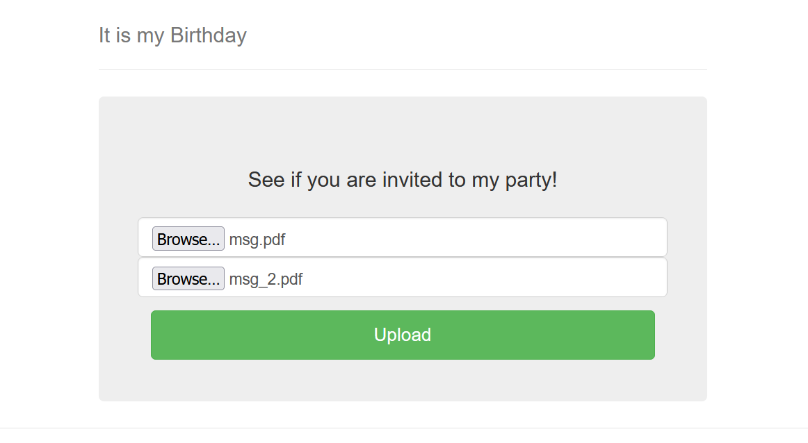
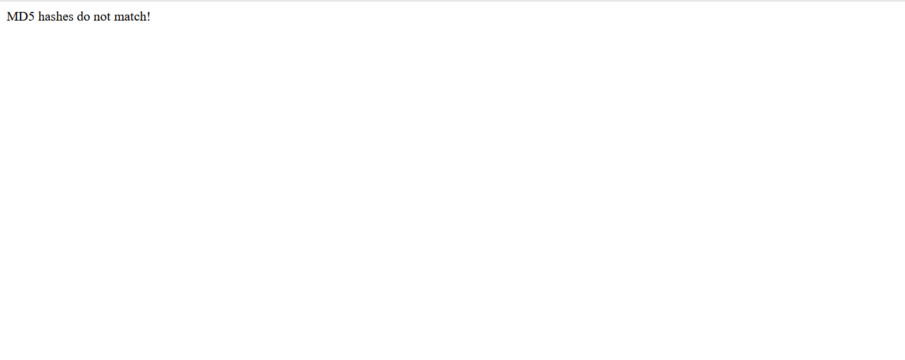
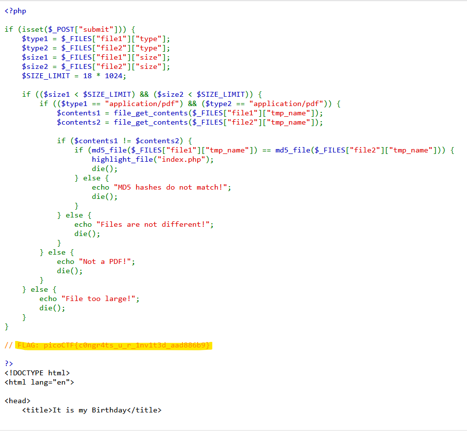

# Web Exploitation --> It is my Birthday.
This is [Link-Lab](https://play.picoctf.org/practice/challenge/109?category=1&page=1&solved=1).
# Solve It is my Birthday.
1- This lab solved when upload two files have the same `hashes` --> `collesion md5 hash`, try different hashes and look at the result.

 

 

2- Try two file have the same `hash`.
 

 
