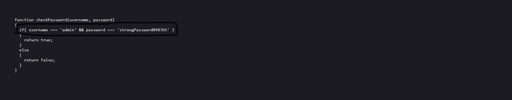

# Web Exploitation --> Local Authority.
This is [Link-Lab](https://play.picoctf.org/practice/challenge/278?category=1&page=2&solved=0).
# Solve Local Authority.
1- Enter url --> `http://saturn.picoctf.net:55826/`, and check it.
 

 

2- From `view page source`, check all directories --> `style.css`, `login.php`.
 

 

3- Enter `login.php` directory, and check directories --> `secure.js` and content `login.php`.
 

 

4- Enter `secure.js` directory, you will find `user and password.`.
 

 

5- Try copy and past `user`, `password` in page, then `flag` appeared.
 

 