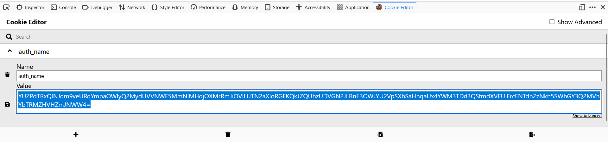
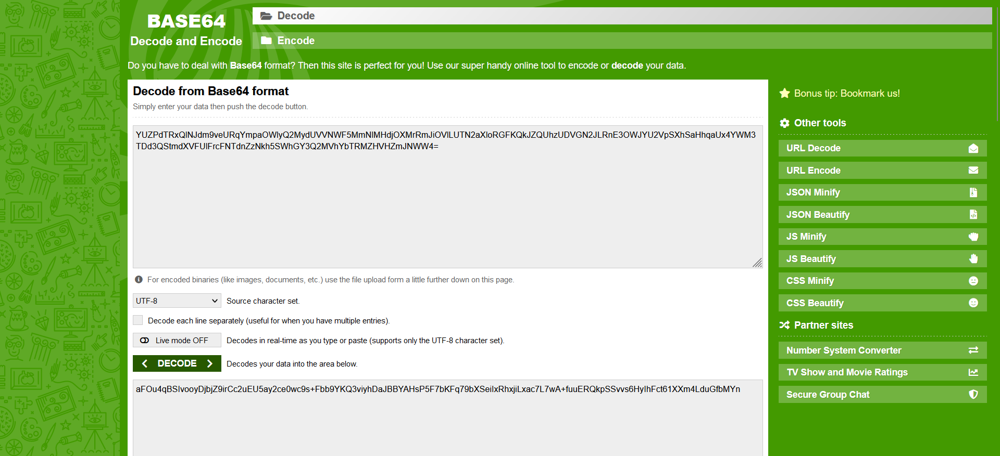
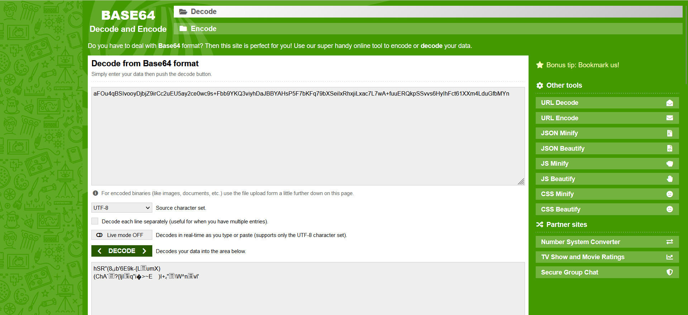
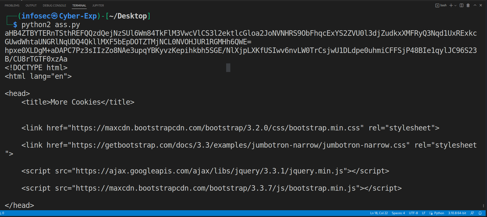
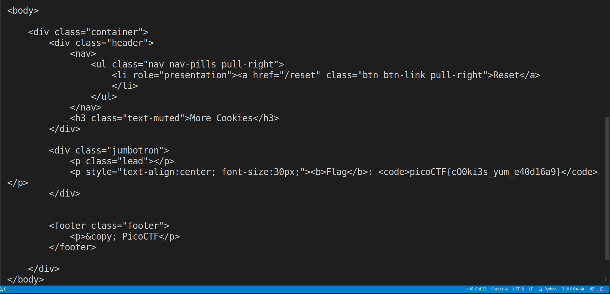

# Web Exploitation --> More Cookies.
This is [Link-Lab](https://play.picoctf.org/practice/challenge/124?category=1&page=1&solved=1).
# Solve More Cookie.
1- Look cookie in this web site, by named `auth_name`.
 

 

2- `auth_name` encode with `base64`, go to online `encode to decode` and reverse, and try reverse it.
 

 

 

3- To solve this challenge to get `flag`, use the `wemc.py` script `python2 wemc.py` to exploit the web site.
 

 

 