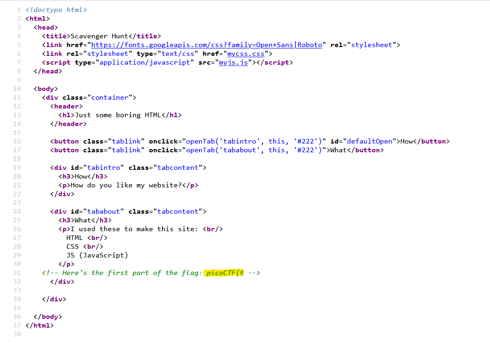
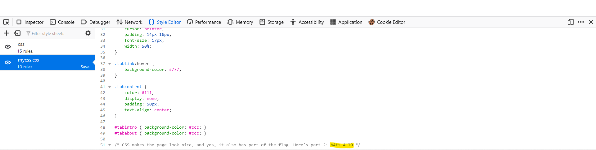
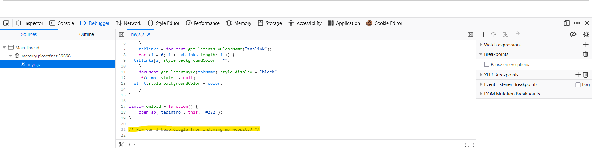
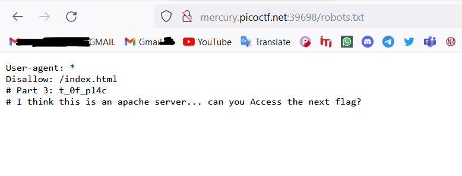
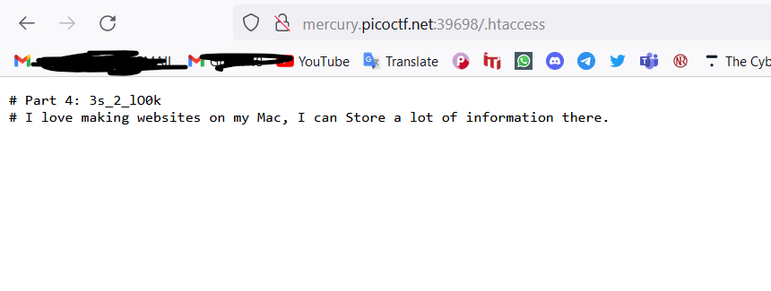
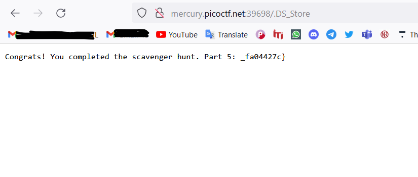

# Web Exploitation --> Scavenger.
This 
 

# Solve Scavenger.

1- Screenshot for the web site.
 

 

2- press right click on mouse then select `view page source` then copy and past --> part one from flag.
 

 

3- click `f12` from the keyboard then show resouces --> web site then select `mycss.css` the copy and past part two from flag.
 

 

4- Then select `myjs.js` from resources --> web site.
 

 

5- try dictionary `robots.txt` --> (Robots.txt is a text file with instructions for search engine crawlers.) then copy and past part three.
 

 

6- try dictionary `.htaccess` --> (a tool that allows configurations at the directory and subdirectory level.) then copy and past part four.
 

 

7- try dictionary `.DS_Store` --> (MAC-OS contain information about system configuration.) then copy and past the final part of the flag.
 

