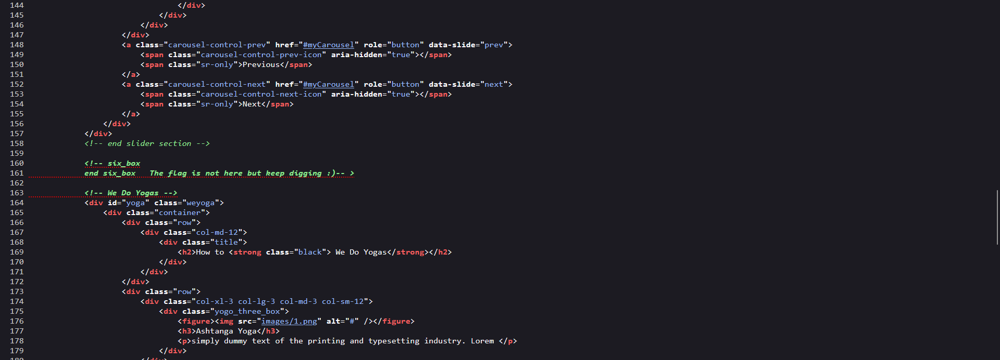
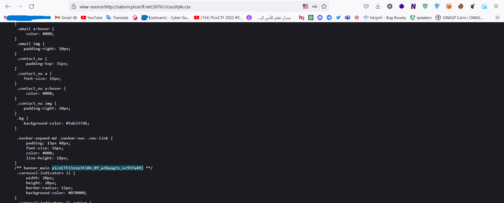

# Web Exploitation --> Search source.
This is [Link-Lab](https://play.picoctf.org/practice/challenge/295?category=1&page=2&solved=0).
# Solve Search source.
1- check the url --> `http://saturn.picoctf.net:50761/`, check it.
 

 

2- From `view page source`, check it.
 

 

3- After digging the all directories, you will find the flag in `css/style.css` directory.
 

 