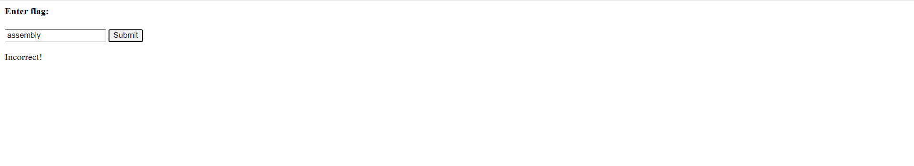

# Web Exploitation --> Some Assembly Required 1.
This is [Link-Lab](https://play.picoctf.org/practice/challenge/152?category=1&page=1).
 

# Solve Some Assembly Required 1.
1- check the web site, try search for `assembly`, but the flag `Incorrect`.
 

 

2- press `f12` from keyboard, select `resourses` tab, find `wasm` --> `WebAssembly (abbreviated Wasm) is a binary instruction format for a stack-based virtual machine`, then check it, you will find the flag, copy and past in search box, the result is `Correct`.
 

 