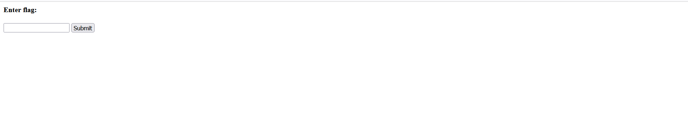
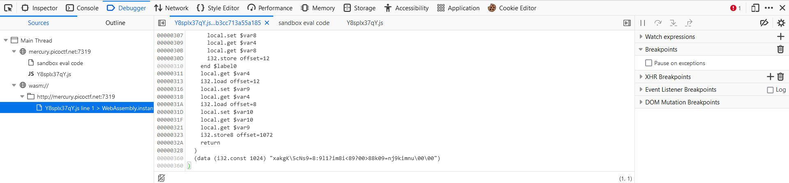
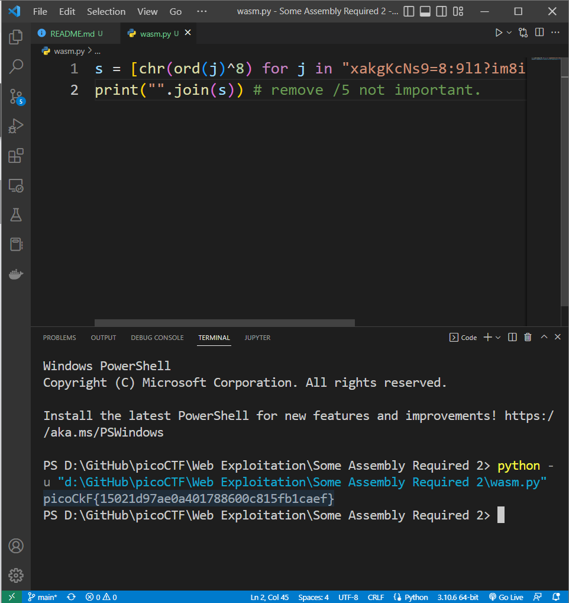

# Web Exploitation --> Some Assembly Required 2.
This is [Link-Lab](https://play.picoctf.org/practice/challenge/131?category=1&page=2&solved=0).
# Solve Some Assembly Required 2.
1- Enter url --> `http://mercury.picoctf.net:7319/index.html`, and check it.
 

 

2- From `Inspect`, select `Debugger` --> select `wasm://` in the end the file internal --> `xakgK\5cNs9=8:9l1?im8i<89?00>88k09=nj9kimnu\00\00`.
 

 

3- Using script `wasm.py` will get the `flag`, but you must modify the flag from `picoCKF{15021d97ae0a401788600c815fb1caef}` --> `picoCTF{15021d97ae0a401788600c815fb1caef}`, k --> T.
 

 