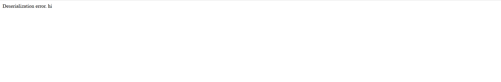

# .Web Exploitation --> Super Serial.
This is [Link-Lab](https://play.picoctf.org/practice/challenge/180?category=1&page=1&solved=1).
# Solve --> Super Serial.
1- Enter the url --> `http://mercury.picoctf.net:2148/`, and check it.
 

 

2- The first step, enum for directoies of web site, try --> `robots.txt`.
 

 

3- Try open directory --> `admin.phps`, but `Not Found`.
 

 

4- Try open directory --> `admin.php`, but `Not Found`.
 

 

5- Try open defult directory --> `index.php`, then `trace the code`.
 

 

6- After tracing code --> you will open `authentication.phps` directory.
 

 

7- After trace the code, you open `cookie.phps` directory.
 

 

8- After trace the code, you will create cookie with `PHPSESSID`, with name `login` and set rendom value in site --> `http://mercury.picoctf.net:2148/authentication.php`.
 

 

9- Open the url `http://mercury.picoctf.net:2148/authentication.php`, with `PHPSESSID and login` --> will appear error --> `Deserialization error`.
 

10- From tracing the code --> you will create cookie, about way: same code usage in diresctories --> `print(urlencode(base64_encode(serialize("hi"))))`.
 

 

11- After execution, copy and past the value of execution in `login` cookie.
 

 

12- Then `refresh the page`.
 

 

13- Try again trace the code in `authentication.phps` --> `<?php class access_log { public $log_file; function __construct($lf) { $this->log_file = $lf; }` --> try create `cookie --> login` To get the flag.
 

 

14- After execution, copy and past in value of `login cookie`.
 

 

15- After refresh the page, you will find the flag.
 

 