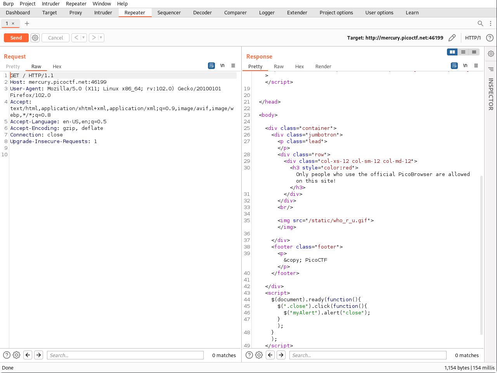
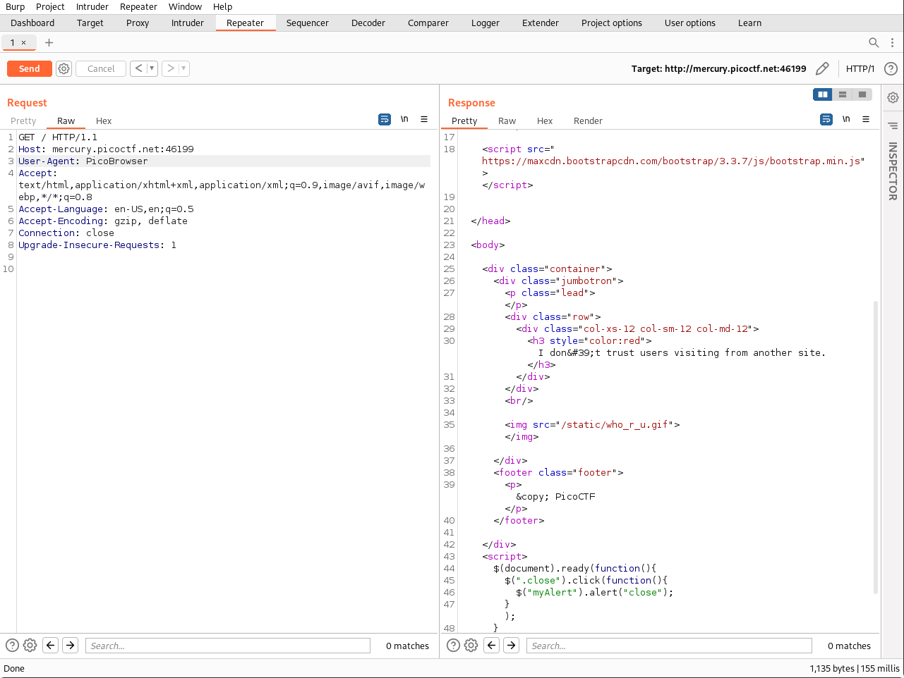
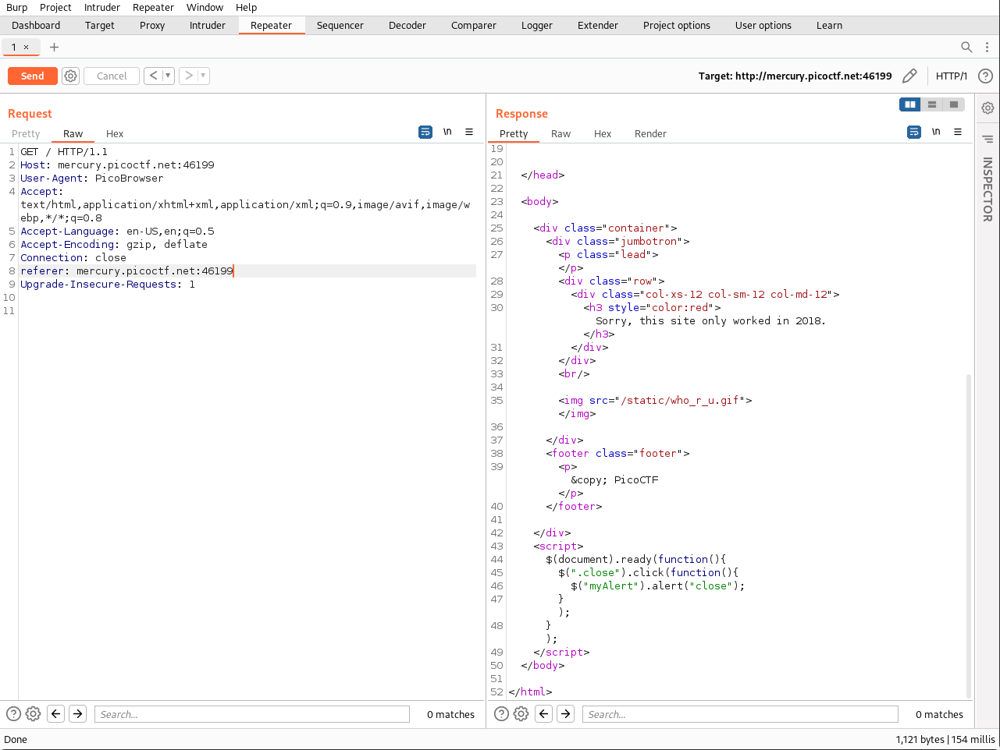
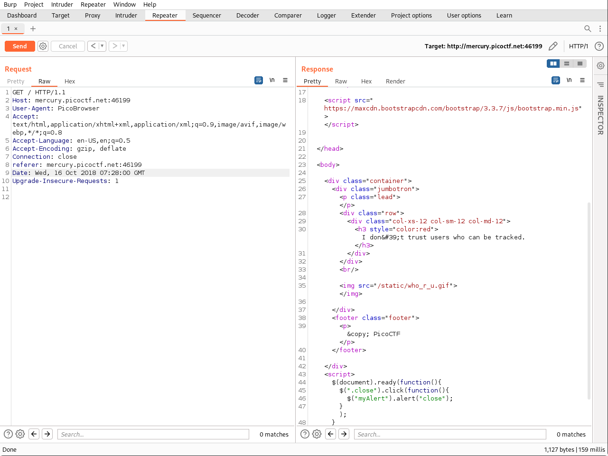
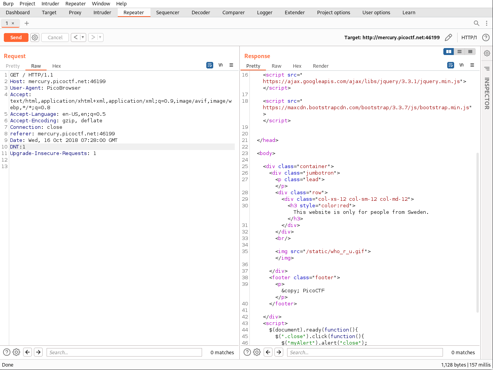
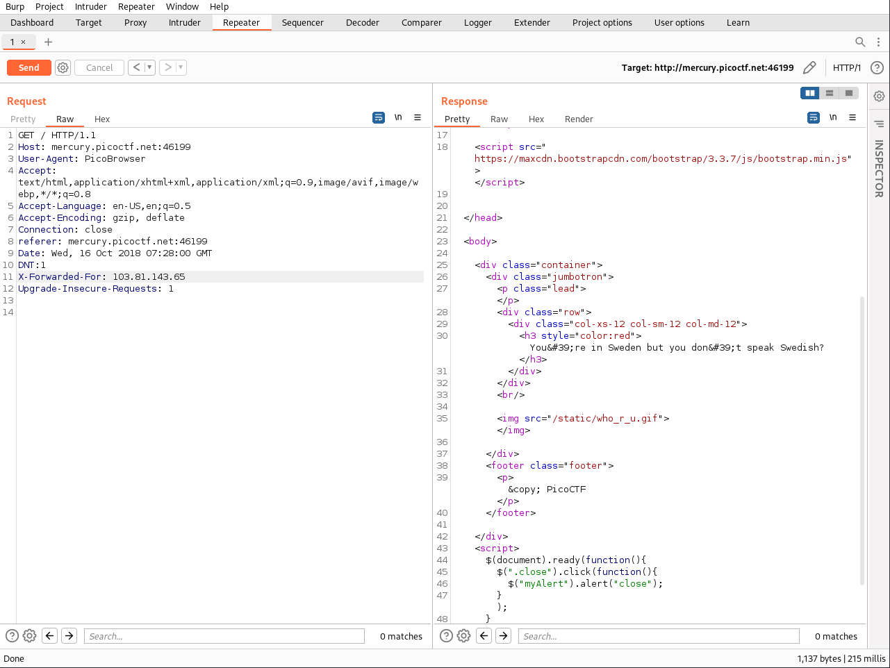
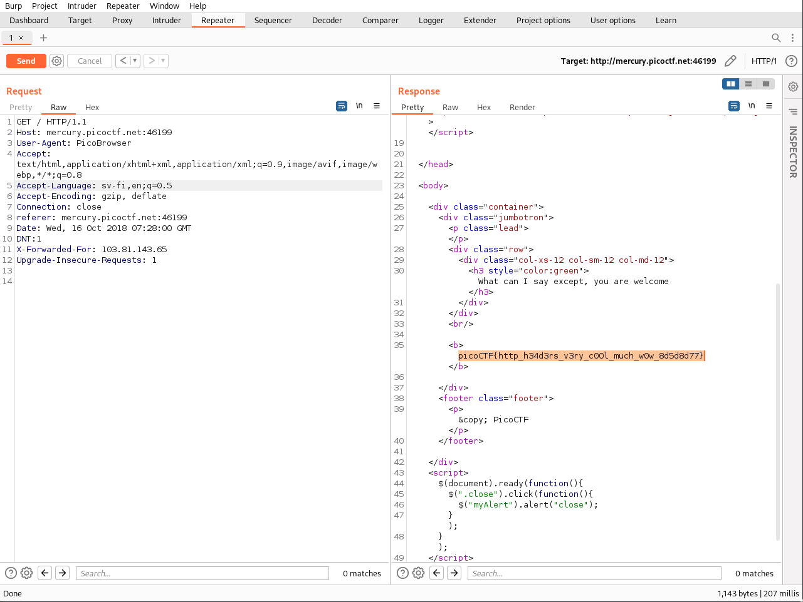

# Web Exploitation --> Who are you?
This is [Link-Lab](https://play.picoctf.org/practice/challenge/142?category=1&page=1&solved=0).
# Solve Who are you?
1- Intercept the request with `Burpsuite`, to analysis the request, then must change the browser name to `PicoBrowser`, then send request. 

 

2- Must change change the `referer` parameter to success the request `referer: http://mercury.picoctf.net:46199 `, then send request.
 

 

3- Must change the year to `2018`, then send request.
 

 

4- Must to use `DNT` prameter to enable `tracing`, then send request.
 

 

5- Must change youe IP address until it be `sweden`, `X-Forword-For: 103.81.143.65 `, then send request.
 

 

6- Must change the language to `sv-fi`, then send request.
 

 

7- Finally, copy and past the `flag`.
 

 
