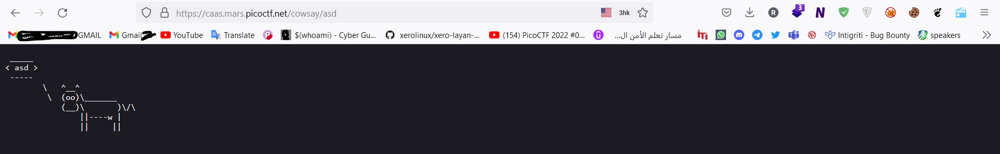
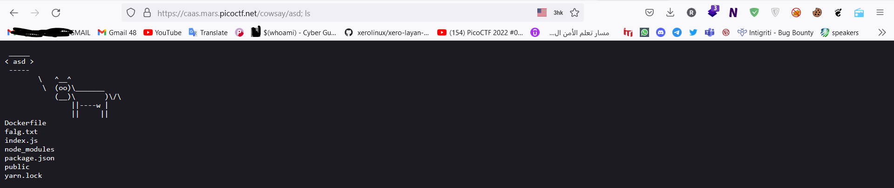
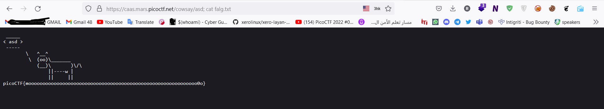

# Web Exploitation --> caas.
This is [Link-Lab](https://play.picoctf.org/practice/challenge/202?category=1&page=2).
# Solve caas.
1- Open url --> `https://caas.mars.picoctf.net/`, and check it --> then trace file `index.js`
 

2- search about `Cowsay as a Service` --> you will find --> `Prototype Pollution`, and wirte any thing after the url --> `https://caas.mars.picoctf.net/cowsay/asd`.
 

 

2- Then add new parameter --> `https://caas.mars.picoctf.net/cowsay/asd; ls`.
 

 

3- then capture the file `falg.txt`.
 

 