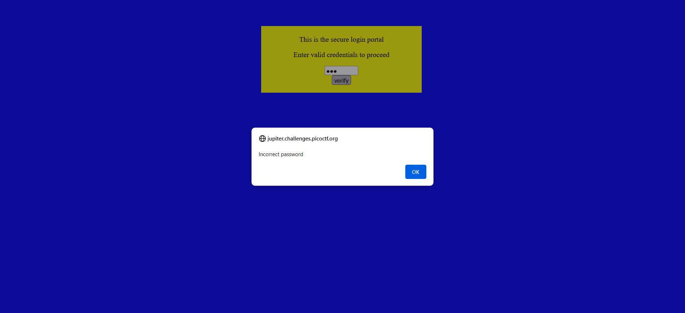
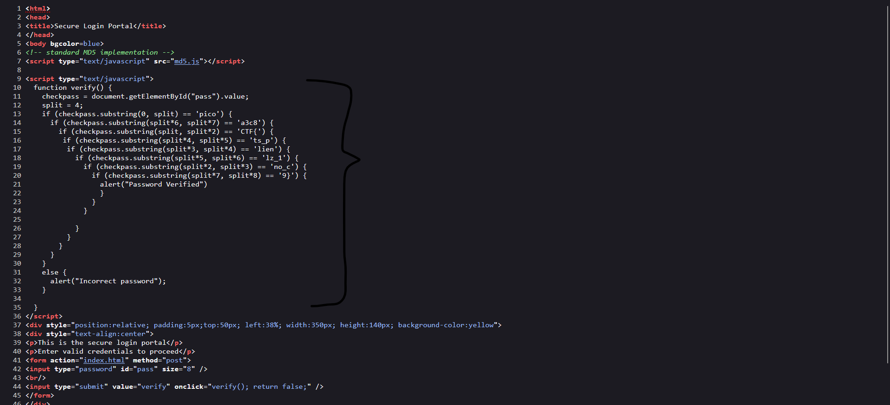
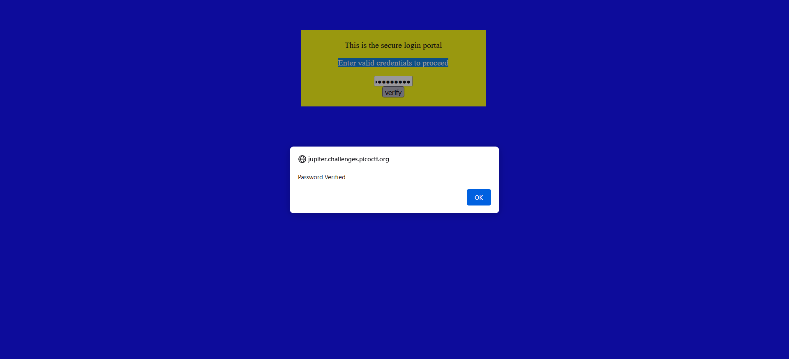

# Web Exploitation --> dont-use-client-side.
This is [Link-Lab](https://play.picoctf.org/practice/challenge/66?category=1&page=1&solved=0).

# Solve dont-use-client-side.
1- Check the web site, try enter any value.
 

 

2- Go to `view page source`, and try to `trace the code` written with `javascript` code.
 

3- After `tracing code`, you will find the flag: `picoCTF{no_clients_plz_1a3c89}`, and copy past in box to validation it.
 

 