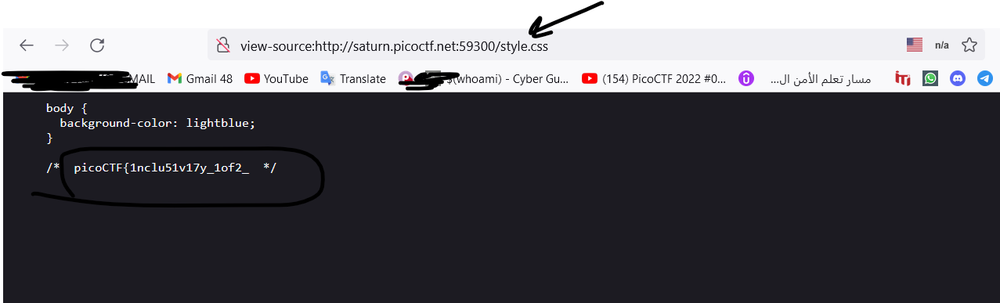

# Web Exploitation --> includes.
This is [Link-Lab](https://play.picoctf.org/practice/challenge/274?category=1&page=1&solved=1).
# Solve includes.
1- Enter url --> `http://saturn.picoctf.net:59300/`, and check it.
 

 

2- from `view page source` --> you will find two directories `style.css`, `script.js`.
 

 

3- first enter in the first directory --> `style.css`, then copy and past the part from flag.
 

 

4- first enter in the first directory --> `script.js`, then copy and past the part from flag, finally submit the flag.
 

 