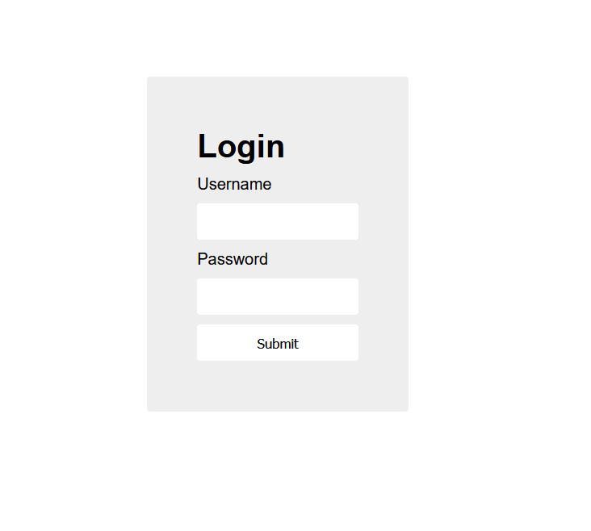
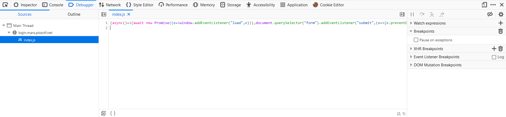
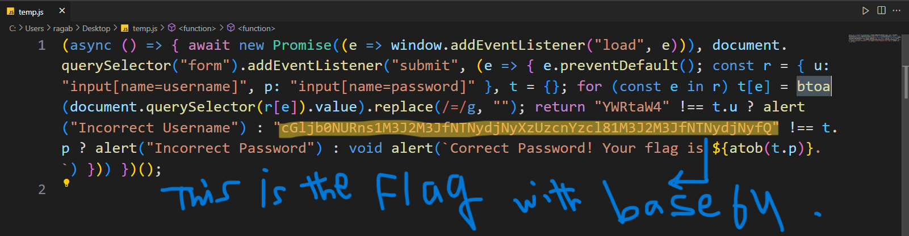
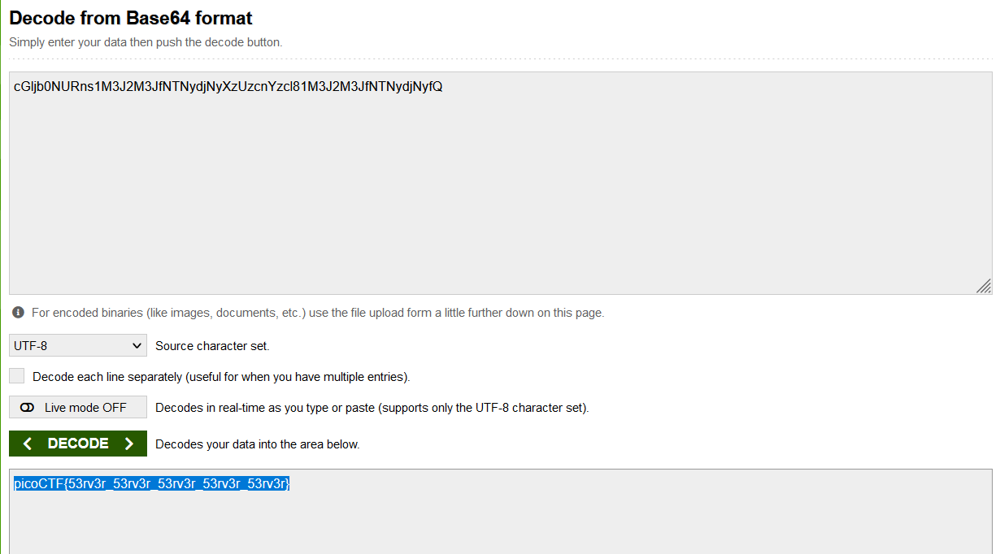

# Wed Exploitation --> login.
This is [Link-Lab](https://play.picoctf.org/practice/challenge/200?category=1&page=1&solved=1).
# Solve login.
1- Enter url --> `https://login.mars.picoctf.net/`, and check it.
 

 

2- Press right click using mouse, and select `Inspect`, then select `resources`.

 

3- select the file end extention `.js`, and `trace` the code, you will find `btoa()` function used to `encode base64`.
 

 

3- copy the flag with encoded `base64` and decode it.
 

 