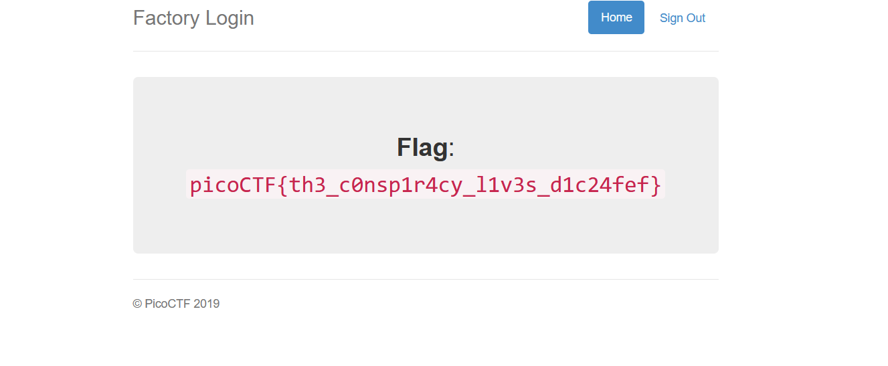

# Web Exploitation --> logon
This is [Link-Lab](https://play.picoctf.org/practice/challenge/46?category=1&page=1&solved=0).
# Solve logon.
1- Access lab and try login with user `joe`, but we have not the password, then we use `sqli` to login without password `joe '--`, then write any password and press login button.
 

 
2- After login.
 

 

3- go to `f12` --> `Storage` --> `Cookie` --> `admin --> True`.
 

 

 

4- Then `refresh` the web page, and copy past the flag.
 

 