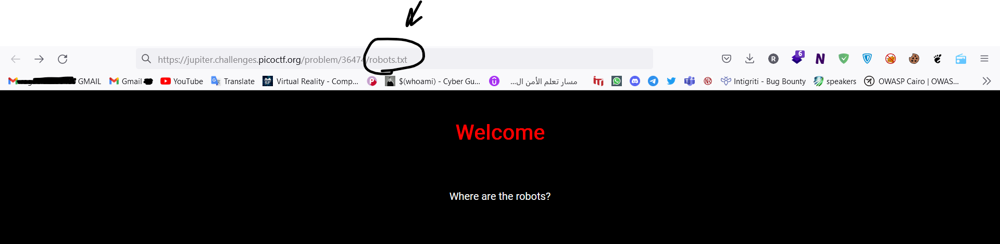
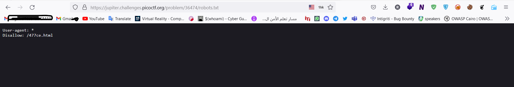
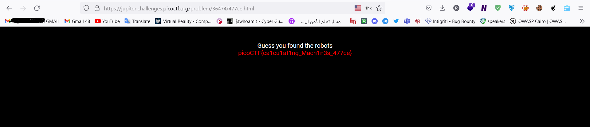

# Web Exploitation --> where are the robots.
This is [Link-Lab](https://play.picoctf.org/practice/challenge/4?category=1&page=1&solved=1).
# Solve where are the robots.
1- Enter the web site and check it, then add dictionary `/robots.txt` after url.
 

 

2- you will appear `Disallow: /477ce.html`.
 

 

3- Try another dictionary `/477ce.html`, and finally copy and past `submit` the flag.
 

 